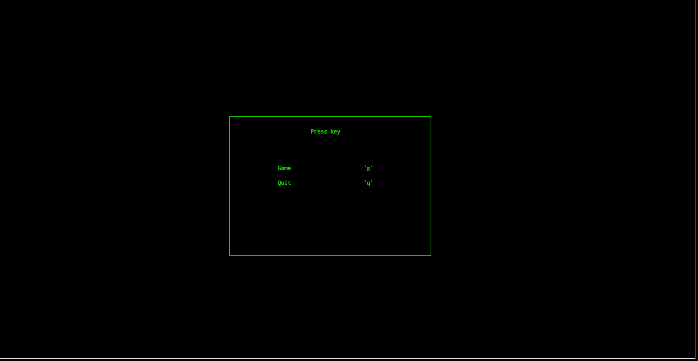
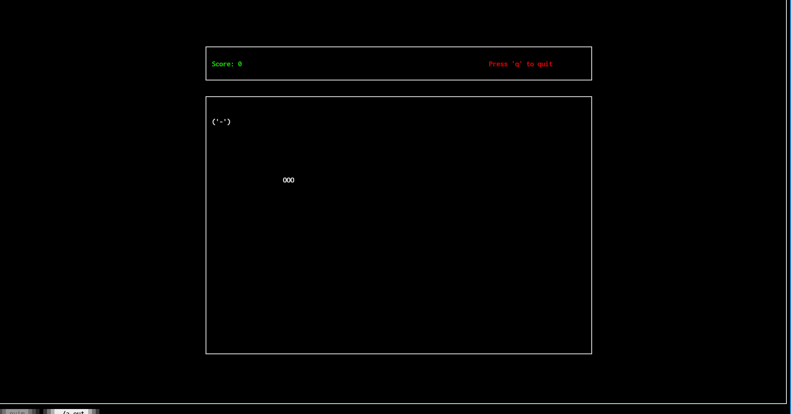
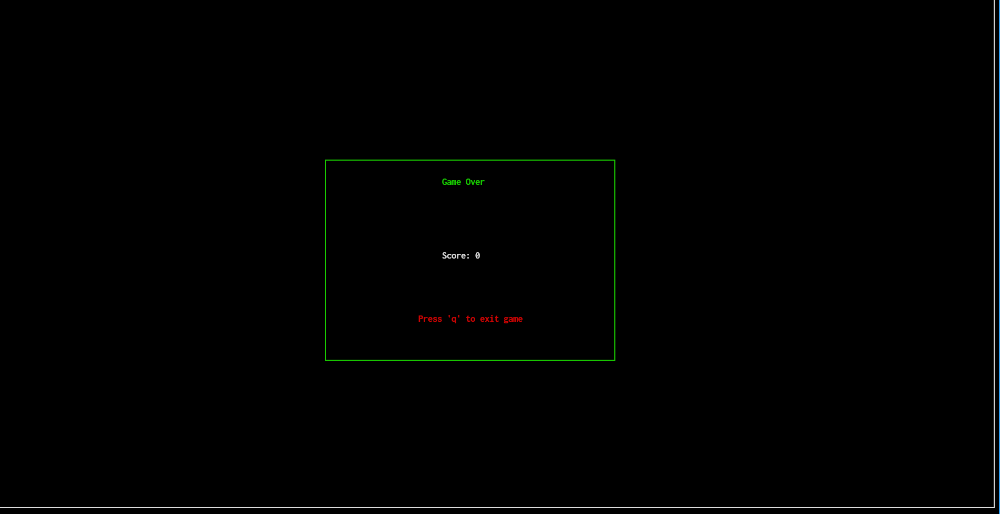

# Snake Game in C (ncurses)

A terminal-based Snake game written in **C** using the **ncurses** library.  
The game features a menu system, real-time movement, collision detection, and game-over handling — all rendered directly in the terminal.

---

## 🎮 Screenshots

### Menu



### Gameplay



### Game Over



---

## 🚀 Features

- Terminal-based UI using ncurses
- Menu → Game → Game Over flow
- Smooth snake movement
- Self-collision & wall collision detection
- Food (frog) spawning
- Score tracking
- Prevents reverse-direction movement
- Clean memory management (no leaks)

---

## 🕹 Controls

| Key | Action     |
| --- | ---------- |
| ↑   | Move Up    |
| ↓   | Move Down  |
| ←   | Move Left  |
| →   | Move Right |
| g   | Start Game |
| q   | Quit Game  |

---

## 🛠 Build & Run

### Requirements

- GCC / Clang
- ncurses

### Install ncurses (Linux)

```sh
sudo pacman -S ncurses #Arch
```

###Window
Native ncurses support on Windows is limited.  
For best results, run this project using **WSL** or another Unix-like environment.

### Compile

clang main.c menu.c game.c gameOver.c snake.c frog.c -lncurses -o snake

### Run

./snake
